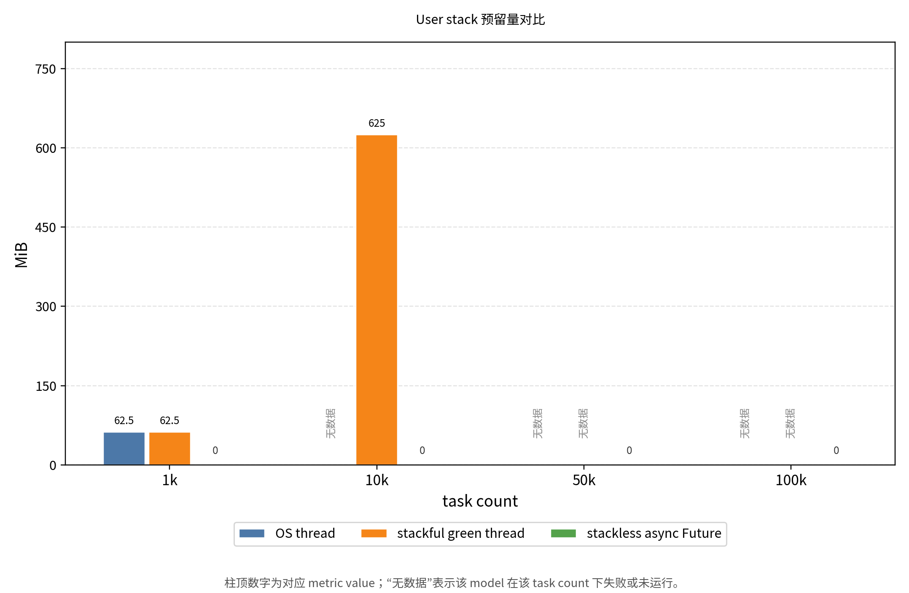
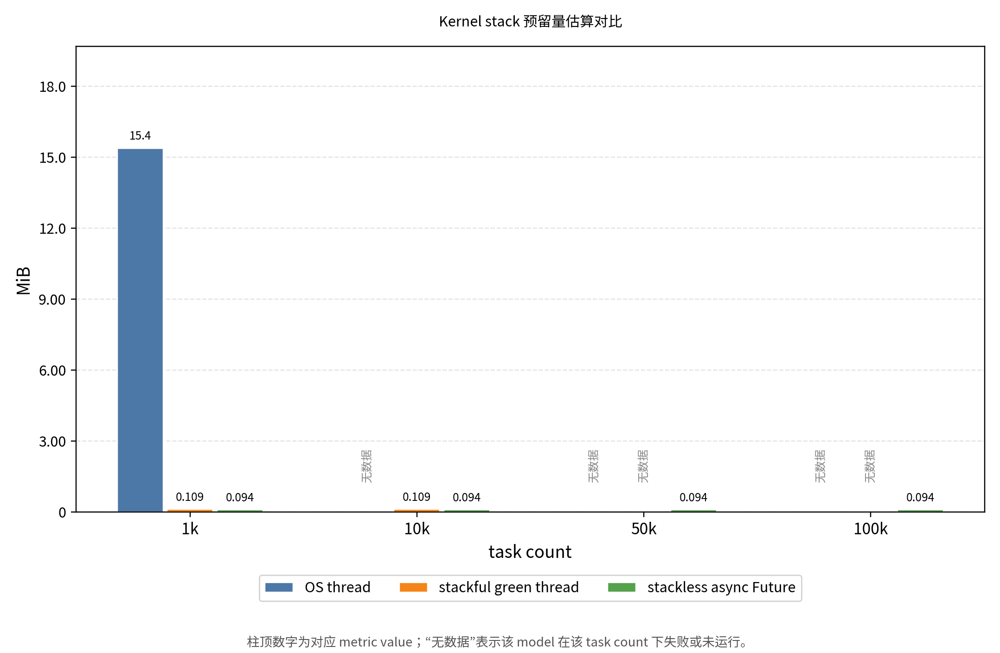
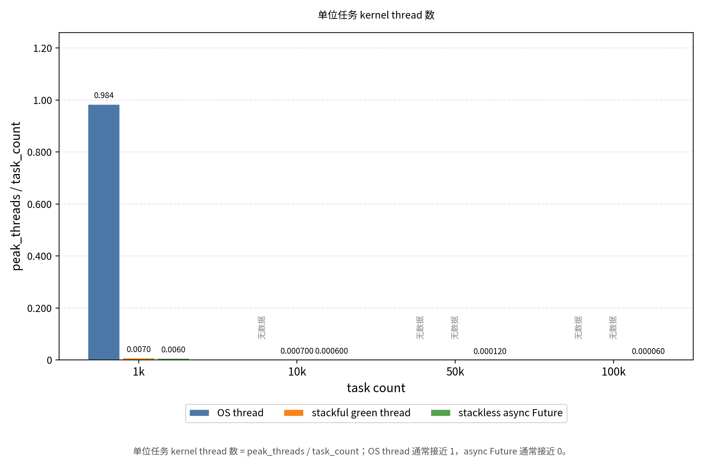
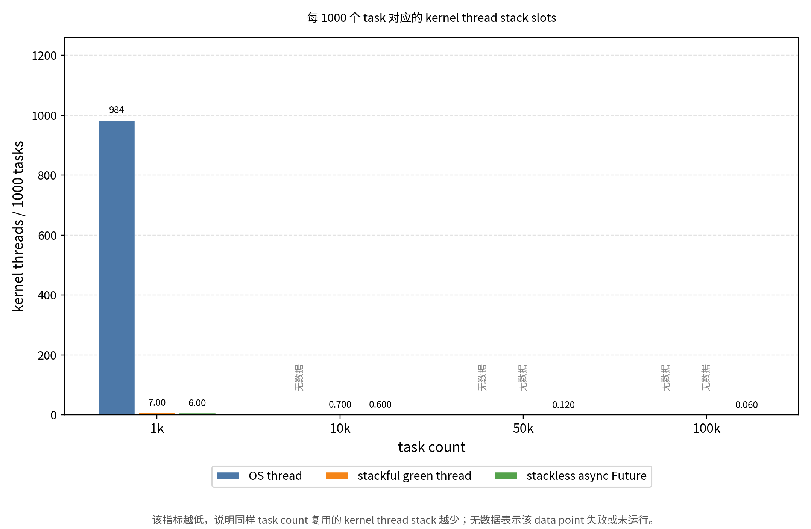
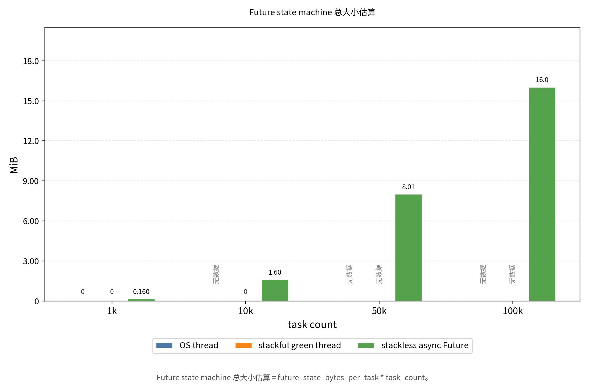
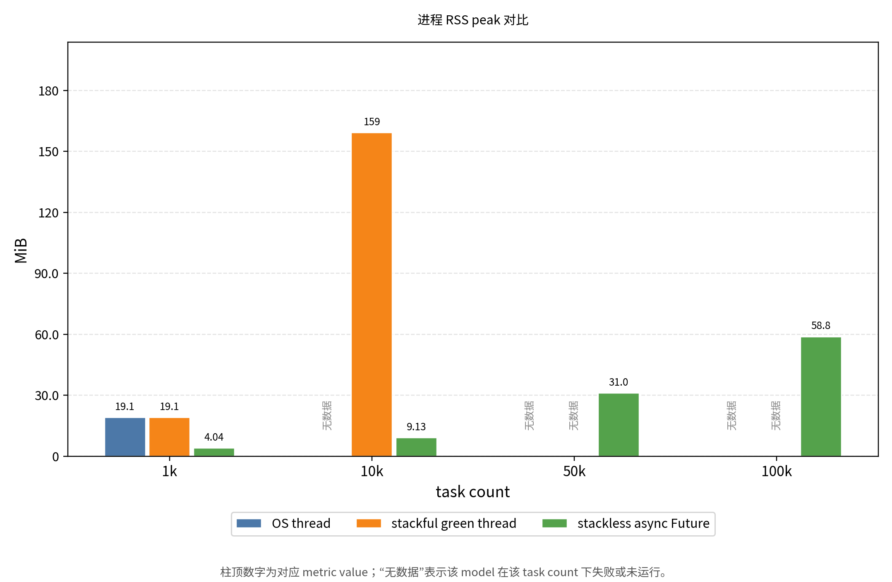
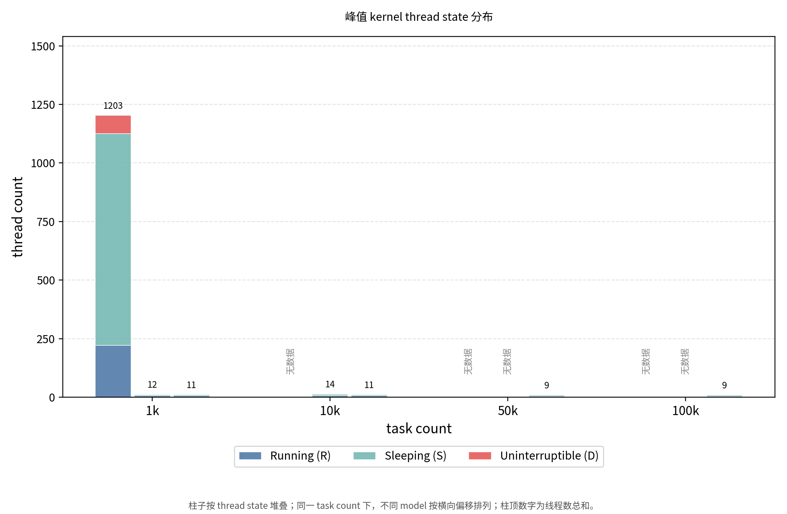

# 有栈执行流与无栈执行流的栈资源占用对比实验报告

## 摘要

本实验围绕 OS thread、有栈 green thread 和无栈 async/Future 三类执行流模型，比较它们在高并发任务场景下的 user stack、kernel stack、整体 RSS 内存以及单位任务资源占用变化。

实验结果表明：

- OS thread 模型接近“一任务一内核线程”，user stack 与 kernel stack 槽位都会随任务数量线性增长。
- 有栈 green thread 能复用少量 OS worker，显著降低 kernel thread/kernel stack 数量，但每个任务仍保留独立 user stack，因此 user stack 预留仍随任务数线性增长。
- 无栈 async/Future 不为每个任务分配独立 user stack，而是用 Future 状态机保存挂起上下文；在 100k 任务下，峰值 kernel thread 仍只有 6 个，说明 kernel stack 槽位没有随任务数增长。

因此，本实验支撑的核心结论是：无栈协程在 I/O/sleep 型高并发场景下节省栈资源的关键，不是让大量独立 kernel stack 空闲，而是避免为每个任务创建独立 OS thread 和独立 kernel stack，同时避免为每个任务保留独立 user stack。

## 1. 实验背景与目标

在操作系统和异步运行时中，执行流可以有不同的上下文保存方式。不同模型对栈资源的占用差异很大，尤其在高并发 I/O 场景下，这种差异会直接影响系统能够承载的任务数量。

本实验比较三类执行流模型：

| 模型 | 栈资源特征 | 调度方式 |
| --- | --- | --- |
| OS thread | 每个任务对应独立 user stack 与 kernel stack | OS kernel 调度 |
| Green thread | 每个任务有独立 user stack，多个任务复用少量 OS worker | 用户态 runtime 调度 |
| Async/Future | 无独立任务栈，挂起上下文保存在 Future 状态机中 | 用户态 runtime 调度 |

实验目标包括：

1. 比较三类执行流模型下的 user stack 预留量。
2. 比较三类执行流模型下的 kernel thread/kernel stack 槽位数量。
3. 比较整体 RSS 内存随任务数增长的变化趋势。
4. 验证 async/Future 在高并发任务下不会产生大量独立 kernel stack。
5. 通过单位任务指标分析不同模型的可扩展性。

## 2. 实验模型说明

### 2.1 OS Thread 模型

OS thread 是由操作系统内核直接管理和调度的线程。每个线程通常对应：

- 一份 user stack：用户态函数调用、局部变量、返回地址等使用。
- 一份 kernel stack：系统调用、中断、异常、调度等进入内核态时使用。

其资源关系可以概括为：

```text
任务数 N -> N 个 OS thread -> N 份 user stack + N 份 kernel stack
```

优点：

- 编程模型直观。
- 可以直接利用多核 CPU。
- 适合计算密集型或数量较少的并行任务。

缺点：

- 每个任务都需要独立 OS thread，线程数量增长快。
- user stack 和 kernel stack 都随任务数线性增长。
- 高并发下容易遇到线程数、PID、虚拟内存、调度开销等系统限制。

### 2.2 有栈 Green Thread 模型

Green thread 是用户态执行流，由 runtime 自己调度。本实验使用 `may` coroutine 表示有栈绿色线程。每个 green thread 有独立 user stack，但它们复用少量 OS worker thread。

其资源关系可以概括为：

```text
任务数 N -> N 个 green thread -> N 份 user stack + 少量 OS worker/kernel stack
```

优点：

- 避免一任务一 OS thread。
- kernel thread 数量主要由 worker 数决定，不随任务数线性增长。
- 相比 OS thread，高并发 I/O/sleep 场景的 kernel stack 压力更低。

缺点：

- 每个任务仍有独立 user stack。
- user stack 预留量仍随任务数线性增长。
- 用户态调度和栈切换需要 runtime 支持，调试和行为理解比 OS thread 更复杂。

### 2.3 无栈 Async/Future 模型

Rust `async fn` 会被编译成 Future 状态机。任务在 `.await` 处挂起时，不保存一整段调用栈，而只保存恢复执行所需的状态，例如状态编号、子 Future 和仍需保留的局部变量。

其资源关系可以概括为：

```text
任务数 N -> N 个 Future 状态机 -> 少量 Tokio worker/kernel stack
```

优点：

- 每个任务没有独立 user stack。
- 大量挂起任务复用少量 runtime worker。
- kernel thread/kernel stack 槽位数量基本由 runtime worker 数决定。
- 适合 I/O 密集型和高并发等待型任务。

缺点：

- Future 状态机、调度队列、定时器、waker 等仍会消耗堆内存。
- 编程时需要处理 async 生命周期、Send、Pin、调度边界等问题。
- 对 CPU 密集型任务，如果不主动让出执行权，可能影响 runtime 调度公平性。

## 3. 实验方法

### 3.1 任务设计

每个任务执行一次短时间等待，用于模拟 I/O 或 sleep 型任务：

```text
sleep_ms = 10 ms
```

该任务不会进行大量计算，重点观察大量执行流处于等待或挂起状态时的栈资源占用。

### 3.2 任务规模

设计任务规模为：

```text
1k / 10k / 50k / 100k
```

当前有效数据范围如下：

| 模型 | 当前有效任务规模 |
| --- | --- |
| `os_thread` | 1k |
| `green_thread` | 1k、10k |
| `async_future` | 1k、10k、50k、100k |

说明：当前 CSV 中没有 `os_thread` 在 10k、50k、100k 下的有效结果，也没有 `green_thread` 在 50k、100k 下的有效结果。这些点应视为缺失、失败或未完成，不能解释为资源占用为 0。

### 3.3 采集指标

实验记录的主要指标如下：

| 指标 | 含义 |
| --- | --- |
| `estimated_user_stack_reserved_bytes` | 估算 user stack 预留量 |
| `peak_kernel_threads` | 峰值 kernel thread 数 |
| `kernel_threads_per_task` | 单位任务 kernel thread 数，公式为 `peak_kernel_threads / task_count` |
| `estimated_kernel_stack_reserved_bytes` | 估算 kernel stack 预留量 |
| `kernel_stack_reserved_bytes_per_task` | 单位任务 kernel stack 预留量 |
| `future_state_bytes_per_task` | 单个 Future 状态机大小 |
| `estimated_future_state_bytes` | Future 状态机总量 |
| `peak_rss_bytes` | 进程峰值 RSS |
| `dominant_wait_channel` | 主要内核等待点 |

当前实验中配置：

```text
user stack per OS/green task = 64 KiB
kernel stack per kernel thread = 16 KiB
Future state per async task = 168 bytes
```

需要注意：本实验能验证 kernel stack 槽位数量和单位任务 kernel stack 预留压力，但不能直接测量每个 kernel stack 内部真实使用了多少 bytes。若要测量 byte-level kernel stack utilization，需要进一步使用 eBPF、ftrace、perf 或内核插桩。

## 4. 实验数据总览

### 4.1 峰值资源数据

| 模型 | 任务数 | 耗时 ms | user stack MiB | kernel stack MiB | Future 状态机 MiB | peak RSS MiB | peak kernel threads | kernel threads/task |
| --- | ---: | ---: | ---: | ---: | ---: | ---: | ---: | ---: |
| `os_thread` | 1,000 | 82 | 62.50 | 15.38 | 0.00 | 19.13 | 984 | 0.984000 |
| `green_thread` | 1,000 | 19 | 62.50 | 0.11 | 0.00 | 19.08 | 7 | 0.007000 |
| `green_thread` | 10,000 | 186 | 625.00 | 0.11 | 0.00 | 159.12 | 7 | 0.000700 |
| `async_future` | 1,000 | 12 | 0.00 | 0.09 | 0.16 | 4.04 | 6 | 0.006000 |
| `async_future` | 10,000 | 19 | 0.00 | 0.09 | 1.60 | 9.13 | 6 | 0.000600 |
| `async_future` | 50,000 | 61 | 0.00 | 0.09 | 8.01 | 31.02 | 6 | 0.000120 |
| `async_future` | 100,000 | 133 | 0.00 | 0.09 | 16.02 | 58.82 | 6 | 0.000060 |

### 4.2 单位任务资源数据

| 模型 | 任务数 | user stack KiB/task | kernel stack KiB/task | total stack KiB/task | Future bytes/task | kernel stack slots/1000 tasks |
| --- | ---: | ---: | ---: | ---: | ---: | ---: |
| `os_thread` | 1,000 | 64.000 | 15.744 | 79.744 | 0 | 984.00 |
| `green_thread` | 1,000 | 64.000 | 0.112 | 64.112 | 0 | 7.00 |
| `green_thread` | 10,000 | 64.000 | 0.011 | 64.011 | 0 | 0.70 |
| `async_future` | 1,000 | 0.000 | 0.096 | 0.096 | 168 | 6.00 |
| `async_future` | 10,000 | 0.000 | 0.010 | 0.010 | 168 | 0.60 |
| `async_future` | 50,000 | 0.000 | 0.002 | 0.002 | 168 | 0.12 |
| `async_future` | 100,000 | 0.000 | 0.001 | 0.001 | 168 | 0.06 |

## 5. 数据对比分析

### 5.1 User Stack 对比

OS thread 与 green thread 都配置了每任务 64 KiB user stack。因此：

- `os_thread/1000` 的 user stack 预留为 62.50 MiB。
- `green_thread/1000` 的 user stack 预留同样为 62.50 MiB。
- `green_thread/10000` 的 user stack 预留增长到 625.00 MiB。
- `async_future` 的 user stack 预留为 0，因为每个 async task 没有独立任务栈。

这说明 green thread 虽然减少了 kernel thread，但仍然保留了有栈执行流的核心成本：每个任务一份用户态栈。

建议报告配图：



### 5.2 Kernel Stack 与 Kernel Thread 对比

OS thread 在 1k 任务下的峰值 kernel thread 数为 984，说明它基本接近一任务一内核线程。按照每个 kernel thread 16 KiB kernel stack 估算，kernel stack 预留为 15.38 MiB。

Green thread 在 1k 和 10k 任务下的峰值 kernel thread 数都为 7，kernel stack 预留保持在约 0.11 MiB。

Async/Future 在 1k、10k、50k、100k 任务下的峰值 kernel thread 数都为 6，kernel stack 预留保持在约 0.09 MiB。

这说明：

```text
OS thread: kernel stack 槽位随任务数增长
Green thread: kernel stack 槽位主要随 worker 数增长
Async/Future: kernel stack 槽位主要随 Tokio worker 数增长
```

建议报告配图：







### 5.3 Future 状态机对比

本实验中单个 Future 状态机大小为 168 bytes。随着任务数增长，Future 状态机总量线性增长：

| 任务数 | Future 状态机总量 |
| ---: | ---: |
| 1,000 | 0.16 MiB |
| 10,000 | 1.60 MiB |
| 50,000 | 8.01 MiB |
| 100,000 | 16.02 MiB |

这说明 async/Future 并不是没有任何 per-task 成本，而是把“独立栈”成本转化成“状态机 + runtime 调度结构”的堆内存成本。相比 64 KiB/task 的独立 user stack，168 bytes/task 的 Future 状态机要小得多。

建议报告配图：



### 5.4 整体 RSS 对比

RSS 反映实际驻留物理内存，包含 runtime、任务对象、调度结构、栈实际提交页等，不等同于栈的虚拟地址空间预留。

当前结果中：

- `green_thread/10000` 峰值 RSS 为 159.12 MiB。
- `async_future/100000` 峰值 RSS 为 58.82 MiB。

也就是说，在当前任务模型下，async/Future 承载 100k 任务的 RSS 仍低于 green thread 承载 10k 任务的 RSS。这直接支撑了无栈协程在高并发等待任务中的内存优势。

建议报告配图：



### 5.5 线程状态与等待点分析

从 `samples (1).csv` 的采样数据看：

- `os_thread/1000` 的 kernel thread 峰值达到 984，采样中大量线程处于 sleeping 或 blocked 状态，主要 wait channel 包括 `futex_wait_queue_me` 和 `hrtimer_nanosleep`。
- `green_thread/10000` 的 kernel thread 峰值只有 7，主要等待点为 `ep_poll`，说明大量 green thread 复用少量 worker 处理事件等待。
- `async_future/100000` 的 kernel thread 峰值只有 6，主要等待点为 `futex_wait_queue_me`，说明大量挂起 Future 没有对应大量独立 kernel thread。

因此，当前采样支持“内核调度实体数量不随 async task 数量增长”的判断。

建议报告配图：



## 6. 模型优劣对比

| 模型 | 优点 | 缺点 | 适用场景 |
| --- | --- | --- | --- |
| OS thread | 模型简单；由 OS 直接调度；适合 CPU 并行 | user stack 与 kernel stack 都随任务线性增长；线程数多时调度和内存压力大 | 少量并行任务、CPU 密集型任务、阻塞式系统接口 |
| Green thread | 减少 OS thread 数量；kernel stack 压力小；可用户态调度 | 每个任务仍有独立 user stack；高并发下 user stack 预留大 | 需要同步写法、但希望减少 OS thread 的并发任务 |
| Async/Future | 无独立任务栈；kernel thread 数量固定；高并发等待任务内存效率高 | 编程模型复杂；存在 Future/runtime 堆内存开销；CPU 任务需主动配合调度 | I/O 密集型、高并发 sleep/timer/network 任务 |

从栈资源角度可以总结为：

```text
OS thread:
任务数 N -> user stack O(N) + kernel stack O(N)

Green thread:
任务数 N -> user stack O(N) + kernel stack O(worker)

Async/Future:
任务数 N -> Future state O(N) + kernel stack O(worker)
```

## 7. 实验支撑的结论

### 结论一：OS Thread 的栈资源扩展性最差

支撑数据：

- `os_thread/1000` 峰值 kernel thread 为 984。
- `kernel_threads_per_task = 0.984`。
- 单位任务总栈预留约 79.744 KiB。

这说明 OS thread 模型在 1k 任务时已经接近一任务一内核线程。若扩展到 10k、50k、100k，理论上 user stack、kernel stack 槽位和调度实体都会继续线性增长，因此很容易失败或超时。

### 结论二：Green Thread 降低 Kernel Stack 压力，但没有消除 User Stack 成本

支撑数据：

- `green_thread/1000` 和 `green_thread/10000` 的峰值 kernel thread 都为 7。
- 10k 任务时 kernel stack 预留仍约 0.11 MiB。
- 10k 任务时 user stack 预留增长到 625.00 MiB。

这说明 green thread 的优势是减少 kernel thread/kernel stack 数量，缺点是每个任务仍需要独立 user stack。

### 结论三：Async/Future 在高并发等待场景下栈资源占用最低

支撑数据：

- `async_future/100000` 峰值 kernel thread 只有 6。
- `kernel_threads_per_task = 0.000060`。
- user stack 预留为 0。
- Future 状态机总量约 16.02 MiB。
- 峰值 RSS 约 58.82 MiB。

这说明 async/Future 可以用少量 OS worker 承载大量挂起任务，栈资源不会随任务数线性增长。

### 结论四：所谓“内核态栈空闲”应更准确表述为“Kernel Stack Slot 不随任务数增长”

无栈协程并不是为每个 async task 创建一个空闲 kernel stack。更准确的机制是：

```text
async task 不对应独立 OS thread
async task 不对应独立 kernel stack
大量挂起 Future 共享少量 runtime worker 的 kernel stack
```

因此，本实验验证的是：

- 大量 async task 不产生大量 kernel stack slot。
- 单位任务 kernel thread 数随任务规模增大快速下降。
- kernel stack 预留压力由 runtime worker 数决定，而不是由 async task 数决定。

如果要进一步证明 kernel stack 内部真实 byte-level utilization，需要补充更底层的内核观测工具。

## 8. 实验局限

当前实验仍有以下限制：

1. `os_thread` 缺少 10k、50k、100k 的有效数据，可能由于系统线程数、PID、虚拟内存或超时限制导致。
2. `green_thread` 缺少 50k、100k 的有效数据，需要继续补跑或记录失败原因。
3. 当前 kernel stack 数据是根据 kernel thread 数和 16 KiB/thread 估算得到，并非内核栈真实使用深度。
4. 当前任务是 sleep/I/O wait 型任务，结论主要适用于高并发等待场景，不代表 CPU 密集型任务。
5. RSS 受到 allocator、runtime、虚拟内存提交策略等因素影响，应与 stack reserved 指标分开解释。

## 9. 后续工作

后续可以继续完善：

1. 对 OS thread 的 10k、50k、100k 记录失败原因，例如 `ulimit -u`、`pid_max`、OOM、timeout。
2. 对 green thread 的 50k、100k 补跑数据或记录失败日志。
3. 增加 eBPF/ftrace/perf 观测，测量 kernel stack 的真实使用深度。
4. 增加不同 `sleep_ms`、不同 worker 数、不同 stack size 的对照实验。
5. 将 CSV 结果自动生成报告表格，减少手工整理成本。

## 10. 最终结论

本实验从数据上证明了三类执行流模型在栈资源占用上的根本差异：

- OS thread 的 user stack 和 kernel stack 都随任务数增长，扩展性受系统线程资源限制。
- Green thread 将大量任务映射到少量 OS worker，降低 kernel stack 压力，但仍保留每任务 user stack 成本。
- Async/Future 将挂起上下文保存在 Future 状态机中，不为每个任务创建独立 user stack 或 kernel stack，在高并发等待场景下具有最好的栈资源扩展性。

因此，对于大量 I/O/sleep 型并发任务，无栈 async/Future 模型在栈资源和整体内存占用上明显优于 OS thread 和有栈 green thread。

