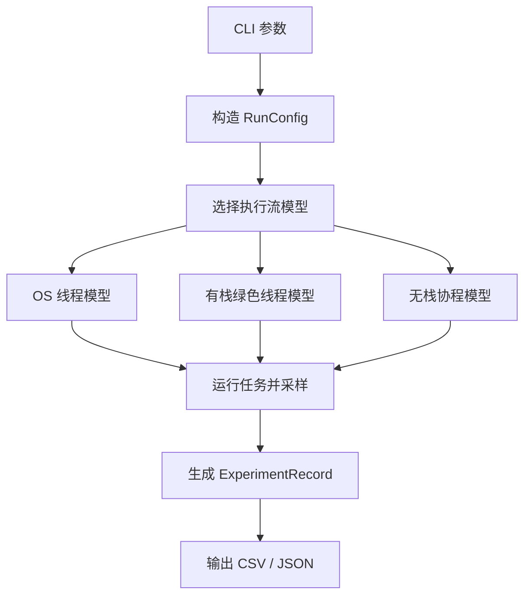

# 执行流模型设计思想与实验逻辑说明

## 1. 文档目的

本文档用于说明本实验中三类执行流模型的整体设计思想、代码组织方式和指标采集逻辑。它关注“实验为什么这样设计”和“代码如何对应实验模型”，不填写具体实验数据；具体数据、图表和结论应写入 `reports/experiment_report_template.md`。

本实验比较的三类模型是：

- OS 线程：每个任务对应一个系统线程。
- 有栈绿色线程：每个任务对应一个用户态 coroutine，拥有独立用户态栈。
- 无栈协程：每个任务对应一个 Future 状态机，挂起时不保留独立任务栈。

核心目标是观察高并发任务数量增长时，用户态栈、内核态栈估算值和进程整体内存占用的变化趋势。

## 2. 总体设计思想

本实验把“执行流”抽象成三个部分：

| 抽象维度 | 含义 | 对应实验关注点 |
| --- | --- | --- |
| 任务上下文 | 一个任务挂起或切换时需要保存什么 | 用户态栈或 Future 状态机大小 |
| 调度主体 | 谁决定任务何时运行 | 内核调度或用户态调度 |
| 内核线程占用 | 执行流是否需要独占内核线程 | 内核线程数和内核栈估算 |

三种模型的本质区别在于：任务上下文保存在哪里、任务是否独占内核线程、任务挂起后是否仍保留独立栈。

OS 线程模型中，每个任务都对应一个内核线程，因此用户态线程栈和内核线程栈都会随任务数近似线性增长。

有栈绿色线程模型中，每个任务仍有独立用户态栈，但大量绿色线程复用少量 worker 内核线程，因此用户态栈随任务数增长，而内核线程数主要由 worker 数决定。

无栈协程模型中，每个任务被编译成 Future 状态机，挂起点只保存必要状态，不为每个任务保留独立用户态栈；大量 Future 复用 Tokio worker 内核线程，因此内核线程数基本稳定。

## 3. 模型与代码对应关系

核心代码位于 `src/models.rs`，每个模型对应一个运行函数：

| 模型 | 运行函数 | Rust 实现 |
| --- | --- | --- |
| OS 线程 | `run_os_thread` | `std::thread::Builder::spawn` |
| 有栈绿色线程 | `run_green_thread` | `may::coroutine::Builder::spawn` |
| 无栈协程 | `run_async_future` | `tokio::spawn` + `async fn` |

三个运行函数都遵循同一套流程：

1. 启动后台采样器。
2. 根据任务数量创建执行流。
3. 让任务尽量同时开始运行。
4. 每个任务触碰一定大小的用户态栈，然后执行 sleep。
5. 等待所有任务结束。
6. 停止采样器。
7. 汇总峰值指标并输出 `ExperimentRecord`。

整体流程如下：



## 4. 任务负载设计逻辑

每个任务都执行相同的逻辑，目的是减少业务逻辑差异，让资源差异主要来自执行流模型本身。

任务逻辑包括两步：

1. 调用 `touch_stack_bytes` 主动触碰固定大小的栈空间。
2. 调用 sleep 制造挂起点或上下文切换点。

这样设计有两个原因。

第一，单纯配置线程栈大小并不一定会让物理内存立即增长。操作系统通常只是预留虚拟地址空间，只有实际访问栈页时，RSS 才可能增长。因此实验使用 `touch_stack_bytes` 主动触碰栈页，使用户态栈压力更容易被观测。

第二，sleep 可以模拟 I/O 等待，使 OS 线程发生阻塞，使绿色线程和 async Future 发生用户态调度或挂起。这样能更清晰地观察高并发等待场景下的资源差异。

## 5. 三种模型的具体逻辑

### 5.1 OS 线程模型

OS 线程模型中，实验为每个任务创建一个系统线程：

```text
任务数 N -> N 个 std::thread -> N 个内核线程
```

每个线程通过 `thread::Builder::stack_size` 设置用户态线程栈大小。任务启动后先等待统一开始信号，然后触碰栈并 sleep。

该模型用于模拟传统“一请求一线程”或“一任务一线程”的并发方式。随着任务数量增加，系统需要维护更多内核线程，用户态线程栈、内核线程栈、调度开销都会增长。

预期现象：

- 用户态栈预留量近似等于 `task_count * os_stack_size`。
- 内核线程数接近任务数。
- 高并发时可能出现线程创建失败。
- VmSize 通常增长明显，RSS 取决于实际触碰了多少栈页。

### 5.2 有栈绿色线程模型

有栈绿色线程模型中，实验为每个任务创建一个 may coroutine：

```text
任务数 N -> N 个 coroutine -> 少量 worker 内核线程
```

每个 coroutine 有独立用户态栈，栈大小由 `may::coroutine::Builder::stack_size` 设置。coroutine 由 may runtime 在用户态调度，底层只使用有限数量的 worker 线程。

该模型用于模拟“用户态线程”或“协程拥有独立栈”的运行方式。它减少了内核线程数量，但仍然为每个任务保留独立用户态栈。

预期现象：

- 用户态栈预留量近似等于 `task_count * green_stack_size`。
- 内核线程数主要由 worker 数决定，不随任务数线性增长。
- 高并发能力通常强于 OS 线程。
- 当任务数很大时，独立 coroutine 栈仍会带来明显内存压力。

### 5.3 无栈协程模型

无栈协程模型中，实验为每个任务创建一个 Tokio task：

```text
任务数 N -> N 个 Future 状态机 -> 少量 Tokio worker 内核线程
```

Rust `async fn` 会被编译为状态机。任务在 `.await` 处挂起时，只保存后续恢复所需的局部状态，而不是保存一整段独立调用栈。

实验通过 `std::mem::size_of_val` 估算单个 Future 状态机大小，并通过 RSS 反映 Tokio task 分配、调度队列、计时器等运行时开销。

需要注意的是，`touch_stack_bytes` 被安排在 `.await` 之前执行。这表示栈压力只存在于执行瞬间；一旦任务到达 `.await` 并挂起，该栈帧不会作为独立任务栈长期保留。这正是无栈协程与有栈绿色线程的关键差异。

预期现象：

- 每个任务没有独立用户态栈预留。
- Future 状态机大小通常远小于线程栈或 coroutine 栈。
- 内核线程数主要由 Tokio worker 数决定。
- 在大量 sleep/I/O 等待任务中，整体内存增长主要来自 Future 和 runtime 数据结构。

## 6. 指标采集逻辑

指标采集代码位于 `src/metrics.rs`。实验启动一个后台采样线程，周期性读取 Linux `/proc/self/status`。

采集和估算的指标包括：

| 指标 | 字段 | 获取方式 |
| --- | --- | --- |
| RSS 峰值 | `peak_rss_bytes` | `/proc/self/status` 的 `VmRSS` |
| 虚拟内存峰值 | `peak_vm_size_bytes` | `/proc/self/status` 的 `VmSize` |
| 主线程栈映射 | `peak_vm_stack_bytes` | `/proc/self/status` 的 `VmStk` |
| 内核线程数峰值 | `peak_kernel_threads` | `/proc/self/status` 的 `Threads` |
| 内核栈预留估算 | `estimated_kernel_stack_reserved_bytes` | `peak_threads * kernel_stack_size` |
| 用户态栈预留估算 | `estimated_user_stack_reserved_bytes` | `task_count * configured_stack_size` |
| Future 状态机估算 | `estimated_future_state_bytes` | `task_count * size_of_val(future)` |

这里要区分“估算值”和“实际采样值”。

用户态栈预留量来自配置值乘以任务数量，表示理论保留或可增长空间；RSS 表示实际驻留内存，只有被访问过的页面才更可能进入 RSS。

内核栈实时使用深度很难从普通用户态程序直接读取，因此实验使用“内核线程数峰值 × 单线程内核栈大小”作为估算值，用来比较趋势。

## 7. 输出数据设计

CLI 程序位于 `src/main.rs`，负责解析参数、选择模型、运行实验并输出结果。

输出文件包括：

| 文件 | 内容 |
| --- | --- |
| `data/results.csv` | 每个模型和任务数量对应一行摘要结果 |
| `data/results.json` | 摘要结果和时序采样点 |
| `data/samples.csv` | 可选，保存运行过程中的采样点 |

CSV 适合直接导入表格或画图脚本；JSON 保留结构化信息，适合后续程序分析。

## 8. 批量实验逻辑

批量脚本位于 `scripts/run_all.sh`。

脚本按如下方式运行：

```text
for model in models:
    for task_count in task_counts:
        启动一个新的 cargo run 进程
        运行单个模型和单个任务数量
        追加写入结果 CSV
```

每个数据点使用独立进程运行，是为了降低运行时缓存、线程池残留、内存分配器缓存对后续实验的影响。如果某个数据点失败，例如 OS 线程在 100000 任务时无法创建足够线程，脚本会把失败记录到 `data/failures.log`，然后继续运行后续数据点。

## 9. 优先级调度扩展逻辑

优先级调度扩展位于 `src/priority.rs`，它不是完整的生产级调度器，而是用于验证实验设想的最小模型。当前代码包含两种调度验证：

- 协作式优先级调度：先清空高优先级队列，再运行低优先级队列。
- 时间片抢占式优先级调度：每个 tick 重新选择最高优先级 ready 任务；如果低优先级任务尚未完成，而高优先级任务在下一 tick 到达，则高优先级任务抢占执行。

协作式模型维护两个队列：

- 高优先级队列。
- 低优先级队列。

运行时先执行所有高优先级任务，再执行低优先级任务。测试 `high_priority_task_completed_before_low_priority` 验证高优先级任务完成顺序早于低优先级任务。

抢占式模型使用离散时间片模拟抢占。每个任务包含：

| 字段 | 含义 |
| --- | --- |
| `priority` | 任务优先级 |
| `ready_at_tick` | 任务变为就绪的时间片 |
| `remaining_ticks` | 任务剩余工作量 |

调度器每个 tick 执行以下逻辑：

1. 将已经到达 `ready_at_tick` 的任务放入就绪队列。
2. 优先选择高优先级队列中的任务。
3. 只运行一个 tick。
4. 如果任务未完成，则重新放回对应优先级队列。
5. 下一 tick 再次选择最高优先级 ready 任务。

示例中 `low-long` 在 tick 0 先运行，`high-short` 在 tick 1 变为 ready。由于调度器每个 tick 都重新选择最高优先级任务，`high-short` 会在 tick 1 抢占 `low-long`，先完成后再恢复低优先级任务。

预期调度轨迹：

```text
dispatch_order = ["low-long", "high-short", "low-long", "low-long"]
completion_order = ["high-short", "low-long"]
```

该部分用于说明：如果后续要在绿色线程或 async runtime 中加入优先级调度，可以先用最小模型验证调度策略，再扩展到真实运行时。真正集成到 runtime 时，抢占点可以来自定时器中断、yield 点、budget 计数器或 executor poll budget。

## 10. 实验边界与注意事项

本实验用于比较趋势，而不是精确测量每一字节内存归属。解释结果时需要注意以下边界：

1. Linux 对线程栈通常采用按需提交策略，配置的栈大小不等于 RSS 立即增长。
2. `/proc/self/status` 的 `VmStk` 主要反映进程主线程栈映射，不代表所有线程栈总和。
3. 普通用户态程序不能直接获得每个内核线程的实时内核栈使用深度，因此内核栈使用以估算为主。
4. Tokio task 除 Future 状态机外，还有调度结构、引用计数、计时器和队列开销，这些会体现在 RSS 中。
5. OS 线程在超高并发下可能因系统限制而创建失败，这也是实验结果的一部分。
6. may coroutine 使用独立用户态栈，栈大小设置过小可能导致运行不安全，因此 `touch_stack_kib` 必须小于 `green_stack_kib`。

## 11. 总结

本实验模型的核心思想是：使用相同任务负载、相同采样方式和相同输出格式，把三种执行流模型放在同一组指标下比较。

从设计上看：

- OS 线程模型强调“内核线程独占”的成本。
- 有栈绿色线程模型强调“用户态调度减少内核线程，但仍保留独立栈”的折中。
- 无栈协程模型强调“挂起状态由状态机保存，不为每个任务保留独立栈”的内存优势。

因此，当任务数量从 1k 增长到 10k、50k、100k 时，可以通过用户态栈估算、内核线程数、内核栈估算和 RSS 峰值观察三种模型在高并发场景下的资源扩展性差异。
